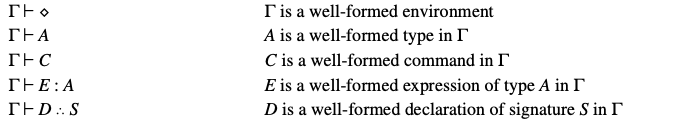

本文整理自 [Luca Cardelli, Type Systems](http://lucacardelli.name/papers/typesystems.pdf) 的第四章内容。欢迎 [star](https://github.com/wfnuser/plt) 和 [follow](https://github.com/wfnuser)。

# 命令式语言中的一阶类型系统 (First-order Type Systems for Imperative Languages)
命令式语言在类型系统方面和函数式语言略有区别，主要是因为它们明确区分了命令（不返回值）和表达式（返回值）。通过给命令赋予 $Unit$ 类型，可以将命令简化为表达式，但我们在这里更倾向于保留两者的区别。

作为命令式语言类型系统的示例，我们在 表20 中总结了无类型命令式语言的语法。这种语言让我们有了学习声明(declarations)的类型规则的机会，这是我们尚未讨论过的。在这种语言中，过程和数据类型的处理非常基础，可以轻松地根据第3章中所描述的规则进行调整。

### 表20. 命令式语言的语法

我们将命令式语言的断言列在表21中。断言 $\Gamma \vdash C$ 和 $\Gamma \vdash E:A$ 对应于 F1 的同一个断言 $\Gamma \vdash M:A$ ，因为我们现在区分了命令 $C$ 和表达式 $E$ 。断言 $\Gamma \vdash D \therefore S$ 将**签名**(signature) $S$ 分配给**声明**(declaration) $D$ ；签名本质上是声明的类型。在这种简单的语言中，签名仅有一个组成部分。例如 $x:Nat$，相应的声明可以是 $var \ x:Nat = 3$ 。通常情况下，一组签名将由类似于此的组件的列表组成，从表面看起来和环境 $\Gamma$ 非常相似。

### 表21. 命令式语言的断言

表22 列出了命令式语言的类型规则。

### 表22. 命令式语言的规则

其中，规则 $(Env \ ...)$ 、 $(Type \ ...)$ 和 $(Expr \  ...)$ 都是由我们在 F1 中看到的规则直接变化而来的。规则 $(Decl \ ...)$ 处理声明的类型。规则 $(Comm \ ...)$ 处理命令；请注意， $(Comm \ Block)$ 在检查块的主体时会将签名转换为环境的一部分。

##
