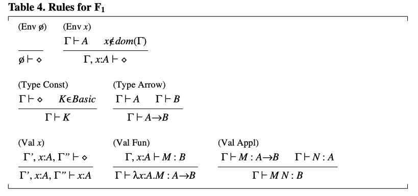
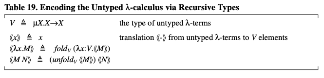

本文整理自 [Luca Cardelli, Type Systems](http://lucacardelli.name/papers/typesystems.pdf) 的第三章内容。欢迎 [star](https://github.com/wfnuser/plt) 和 [follow](https://github.com/wfnuser)。

由于本章公式过于密集，先用截图替代文中的公式，等之后有空的时候再补充对应的 latex 语法。

# 一阶类型系统(First-order Type Systems)

大多数常见的面向过程的编程语言都采用了一阶类型系统。在类型理论的术语中，这意味着它们缺乏参数化类型和类型抽象，这些都是**二阶特性**(Second Order)。一阶类型系统包括（有些令人困惑地）高阶函数。 Pascal 和 Algol68 拥有丰富的一阶类型系统，而 FORTRAN 和 Algol60 的类型系统则非常贫乏。

我们可以为无类型 λ-演算 提供一个最小的一阶类型系统，其中无类型的 λ-抽象 (λ-abstraction) $λx.M$ 表示一个参数为 $x$ 返回值为 $M$ 的函数。对这种演算的类型化只需要提供函数类型和一些基本类型；稍后我们会讨论如何添加其他常见的类型结构。

一阶类型化的 λ-演算 被称为 $F1$ 系统。与无类型 λ-演算 相比的主要变化是为 λ-抽象 添加了类型注释(Type Annotation)，使用语法 $λx:A.M$ ，其中 $x$ 是函数参数，$A$ 是其类型，$M$ 是函数的主体。（在类型化的编程语言中，我们可能会包括结果的类型，但在这里不是必需的。）从 $λx.M$ 到 $λx:A.M$ 的步骤是从无类型语言到类型化语言演化的主要进展：为绑定变量(Bound Variable)赋予类型注释。

由于 $F1$ 主要基于函数值，最有趣的类型是函数类型：$A \to B$ 是具有类型 $A$ 的参数和类型 $B$ 的返回值的函数的类型。而为了构造函数类型，我们还需要先有一些基本类型。我们用 $Basic$ 表示这样的类型的集合，用 $K \in Basic$ 表示任何这样的类型。在这里，基本类型纯粹是技术上的必需品(purely a technical necessity)，但很快我们就会介绍像 $Bool$ 和 $Nat$ 这样有趣的基本类型。

$F1$ 的语法在表 2 中给出。简要讨论一下语法在类型化语言中的作用是重要的。在无类型 λ-演算 的情况下，上下文无关的语法就足够准确地描述合法的程序。但在类型化的演算中，却不是如此，因为良好的行为(good behavior)通常不是上下文无关的特性。描述合法程序的任务被类型系统接管。例如，$λx:K.x(y)$ 虽然遵守表 2 中给出的 F1 的语法，但不是 F1 的程序，因为它不是类型良好的(Well Typed)，因为 K 不是函数类型。上下文无关的语法仍然是有用的，但只是用于定义自由和绑定变量的概念；也就是定义语言的作用域规则。基于作用域规则，只在它们的绑定变量上有所不同的术语，如 $λx:K.x$ 和 $λy:K.y$ ，被认为在语法上是等同的(syntactically identical)。在类型规则中通常采用的是这种简单的等同规则（在应用某些类型规则时可能需要重命名绑定变量）。

### 表2. F1 的语法

$F1$ 的自由变量定义与无类型 λ-演算相同，只是忽略了类型注释。

我们只需要为 $F1$ 做三个简单的断言，如表 3 所示。断言 $\Gamma \vdash A$ 在某种意义上是多余的，因为所有语法上正确的类型 $A$ 在任何环境 $\Gamma$ 中都是良构的(Well Formed)。然而，在二阶系统中，类型的良构不仅仅由语法捕获，断言 $\Gamma \vdash A$ 变得必不可少。出于方便扩展的考虑，我们在这里引入了这个断言。

### 表3. F1 的断言

这些断言的有效性由表 4 中的规则定义。规则 ($Env \ \phi$) 是唯一一个无需假设的规则（即，它是唯一的公理）。它声明空环境是一个有效的环境。规则 ($Env x$) 用于将一个环境 $\Gamma$ 扩展为更长的环境 $\Gamma, x:A$，前提是 $A$ 在 $\Gamma$ 中是一个有效的类型。注意，这里假设 $\Gamma \vdash A$ 已经蕴含了 $\Gamma$ 是有效的。也就是说，在推导 $\Gamma \vdash A$ 的过程中，我们必须已经推导出了 $Γ \vdash \lozenge$。这个规则的另一个要求是变量 $x$ 不能已经在 $\Gamma$ 中被定义。我们小心地保持环境中的变量名是不同的（编者：这是为了避免变量名重复所带来的混乱），所以在 ($Val \ Fun$) 的假设中，当 $\Gamma, x:A \vdash M : B$ 被推导出来时，我们知道 $x$ 不能出现在 $dom(\Gamma)$ (即 $\Gamma$ 的定义域) 中。

### 表4. F1 的规则

规则 $(Type \ Const)$ 和 $(Type \ Arrow)$ 用于构造类型。规则 $(Val \ x)$ 用于从环境中提取一个假设：我们使用符号 $\Gamma', x:A, \Gamma''$ 来非正式地表示 $x:A$ 在环境中某处出现。规则 $(Val \ Fun)$ 给一个函数赋予类型 $A \to B$，前提是函数体在假设参数 $x$ 具有类型 $A$ 的情况下获得类型 $B$。 注意在这个规则中环境的长度是如何变化的。规则 $(Val \ Appl)$ 将一个函数应用于一个参数：在验证前提时，相同的类型 $A$ 必须出现两次。(编者：应该是说在参数类型和函数类型中各出现一次)

表 5 演示了一个比较复杂的推导，其中使用了 $F1$ 的所有规则。

### 表5. F1 中一个推导的例子

现在我们已经审视了一个简单的一阶类型系统的基本结构，我们可以开始丰富它，使其更接近实际编程语言的类型系统。我们将为每种新的类型构造添加一组规则。让我们从一些基本数据类型开始： $Unit$ 类型，其唯一的值是常量 $unit$ ；$Bool$ 类型， 其值是 $true$ 和 $false$ ；以及 $Nat$ 类型，其值是自然数。

$Unit$ 类型通常用作填充无实际意义(Uninteresting)的参数和结果；在某些语言中，它被称为 $Void$ 或 $Null$。$Unit$ 上没有操作，所以我们只需要用一条规则声明 $Unit$ 是一个合法的类型，在用一条规则声明 $unit$ 是 $Unit$ 类型的合法值即可（表 6）。

### 表6. Unit 类型

对于 $Bool$ 类型，我们有类似的规则模式，但 $Bool$ 类型还有一个有用的操作 - 条件表达式。它有自己的类型规则（表 7）。在规则 $(Val \ Cond)$ 中，条件表达式的两个分支必须具有相同的类型 $A$，因为任一分支都可能产生结果。

规则 $(Val \ Cond)$ 展示了一个关于类型检查所需类型信息量的微妙之处。当遇到条件表达式时，类型检查器(Typechecker)必须分别推断出 $N_1$ 和 $N_2$ 的类型，然后找到一个与两者都兼容的单一类型 $A$。在某些类型系统中，可能不容易或无法从 $N_11$ 和 $N_2$ 的类型确定这个单一类型。为了解决这种潜在的类型检查难题，我们使用带下标的类型来表达额外的类型信息：$if_A$ 是一个提示，告诉类型检查器结果类型应该是 $A$，并且为 $N_1$ 和 $N_2$ 推断出的类型应该分别与给定的 $A$ 进行比较。一般来说，我们使用带下标的类型来表示对于类型检查可能有用或必要的信息。类型检查器的任务通常是合成这些额外的信息。当类型检查器能推断出这样的信息时，则可以省略下标。（大多数常见的语言不要求 $if_A$ 注解。）

### 表7. Bool 类型

自然数类型 Nat （见表 8）有 0 和 $succ$（后继） 作为生成器(generators)。也可以像我们之前所做的那样，用一个单独的规则来声明所有数值常量都具有 Nat 类型。通过 $pred$（前驱） 和 $isZero$（测试是否为零）原语可以对 $Nat$ 进行计算。

### 表8. Nat 类型

现在我们已经有了一系列基本类型，我们可以开始研究结构化类型，从乘积类型 (product types) 开始（见表 9）。一个乘积类型 $A_1×A_2$ 是一对值的类型，其第一个组成部分的类型为 $A_1$，第二个组成部分的类型为 $A_2$。这些组成部分可以分别通过投影(projections) $first$ 和 $second$ 提取出来。除了这些投影，还可以使用 $with$ 语句，该语句解构一个对(pair) $M$，并将其组成部分绑定到作用域 $N$ 中的两个独立变量 $x_1$ 和 $x_2$。$with$ 符号与 ML 中的模式匹配相似，也与 Pascal 中的 $with$ 相关； 当我们考虑记录类型 (record types) 时，与后者的联系将变得更加清晰。

乘积类型可以很容易地推广到元组类型 $A_1×...×A_n$ ，并产生相应的推广 $projection$ 和推广 $with$。

### 表9. 乘积类型

联合类型 (Union types, 见表 10) 经常被忽视，但它们和乘积类型一样有着极强的表达力。一个属于联合类型 $A_1+A_2$ 的元素可以被视为是 $A_1$ 的一个元素，并带有一个左标记（由 $inLeft$ 创建），或者是 $A_2$ 的一个元素，并带有一个右标记（由 $inRight$ 创建）。这些标记可以通过 $isLeft$ 和 $isRight$ 进行测试，并且相应的值可以通过 $asLeft$ 和 $asRight$ 提取。如果错误地对一个带有右标记的值应用 $asLeft$，将产生一个被捕获的错误(trapped error)或异常；这种被捕获的错误不被视为禁止错误(forbidden error)。注意，可以安全地假设 $asLeft$ 的任何结果都具有类型 $A_1$，因为参数要么带有左标记，在这种情况下结果确实是类型 $A_1$，要么带有右标记，在这种情况下会抛出错误。下标用于消除一些规则的歧义，正如我们在条件表达式中讨论的那样。

规则 ($Val \ Case$) 描述了一个优雅的构造，可以替代 $isLeft$、$isRight$、$asLeft$、$asRight$ 及相关的被捕获错误。（它还消除了联合类型的操作对 $Bool$ 类型的任何依赖）。$case$ 构造根据 $M$ 的标记执行两个分支中的一个， $M$ 的未标记内容在 $N_1$ 或 $N_2$ 的作用域内分别绑定到 $x_1$ 或 $x_2$。我们用一条竖线分隔这两个分支。

### 表10. 联合类型

从表达能力的角度来看，其实类型 $Bool$ 可以被定义为 $Unit + Unit$，在这种情况下，$case$ 构造就被简化为了条件表达式。类型 $Int$ 可以被定义为 $Nat + Nat$，其中一个 $Nat$ 用于非负整数，另一个用于负整数。我们可以定义一个原型的被捕获错误为 $errorA = asRight(inLeftA(unit)) : A$。因此，我们可以为每种类型构建一个错误表达式。

乘积类型和联合类型可以迭代产生元组类型(tuple types)和多重联合(multiple unions)。 然而，这些派生类型不是很方便，在语言中出现的没有那么多。相反，使用了带标签的乘积和联合：它们分别被称为记录类型 (record types) 和变体类型 (variant types)。

记录类型是命名的类型集合，具有通过名称提取组成部分值的操作。表 11 中的规则假设记录类型和记录本身的各个组件在定义时的各种不同顺序从语法层面上来说都是等价的。

乘积类型的 $with$ 语句在 ($Val \ Record \ With$) 中被推广到记录类型。记录 $M$ 中标记为 $l_1, ..., l_n$ 的组件在 $N$ 的作用域内绑定到变量 $x_1, ..., x_n$。 Pascal 有一个类似的构造，也叫做 $with$，但绑定变量是隐含的。（这导致了一个不好的后果，即作用域依赖于类型检查，并且容易产生由于隐藏的变量冲突而导致的难以追踪的错误。）

乘积类型 $A_1×A_2$ 可以被定义为 $Record(first:A_1, second:A_2)$。

### 表11. 记录类型

变体类型 (Variant types, 见表 12) 是命名的不相交的联合类型；变体类型的多个组件的不同排列从语法层面上来说也是等价的。$is \ l$ 构造泛化了 $isLeft$ 和 $isRight$，$as \ l$ 构造泛化了 $asLeft$ 和 $asRight$。与联合类型一样，这些构造可以被 case 语句替代，只是现在我们有了更多的分支。

联合类型 $A1+A2$ 可以被定义为 $Variant(left:A1, right:A2)$。枚举类型，如 ${red, green, blue}$，可以被定义为 $Variant(red:Unit, green:Unit, blue:Unit)$。

### 表12. 变体类型

引用类型 (Reference types, 见表 13) 可以用作命令式语言中可变地址的基本类型。 $Ref(A)$ 的一个元素是一个包含类型 $A$ 元素的可变单元。可以通过 ($Val \ Ref$) 分配新单元，通过 ($Val \ Assign$) 更新，并通过 ($Val \ Deref$) 显式解引用。由于赋值的主要目的是执行副作用，其结果值被选择为 $unit$。

### 表13. 引用类型

常见的可变类型可以从 $Ref$ 派生。例如，可变记录类型可以被建模为包含 $Ref$ 类型的记录类型。

### 表14. 数组的实现

更有意思的是，数组本身和数组的操作都可以像表 14 中那样被建模，其中 $Array(A)$ 表示具有某种长度且元素类型为 $A$ 的数组类型。表 14 中的代码当然是数组的一种低效实现，但它足以表明一个观点：更复杂构造的类型规则也可以从简单构造的类型规则派生出来。比如表 15 中的数组操作的类型规则就可以很容易地从表 14 派生出来，根据 $products$, $functions$ 和 $refs$ 的规则。

### 表15. 数组类型（派生规则）

在大多数编程语言中，类型可以递归地定义。递归类型(Recursive Types)非常重要，因为它可以使其他类型构造更加有用。递归类型通常是隐式引入的，或者没有精确的解释，它们的特性也很微妙。因此，对它们的形式化处理需要特别小心。

递归类型的处理需要对 $F1$ 类型系统进行一项基本的扩展：环境需要被扩展以包括类型变量 $X$ 。这些类型变量用于形式为 $μX.A$ 的递归类型（表16），直观上就是 $X=A$ 的递归方程的解，其中 $X$ 可以出现在 $A$ 中。操作 `unfold` 和 `fold` 是显式的强制转换，它们在递归类型 $μX.A$ 及其展开 $[μX.A/X]A$ 之间进行映射（其中 $[B/X]A$ 表示用 $B$ 替换 $A$ 中所有出现的自由变量 $X$）。这些强制转换在运行时没有任何实际效果（`unfold(fold(M))=M` 和 `fold(unfold(M’))=M’`）。在实用的编程语言的语法中，`fold` 和 `unfold` 通常会被省略，但它们的存在使得形式化表达更加容易。

### 表16. 递归类型

递归类型常应用于定义列表和树的类型时，与积类型(Product Type)和联合类型(Union Type)结合使用。元素类型为 $A$ 的列表类型 $ListA$ 在表 17 中定义，包括列表构造器 $nil$ 和 $cons$，以及列表分析器(list analyzer) $listCase$。

### 表17. 列表类型

递归类型可以与记录(Record)和变体类型(Variant Type)一起使用，来定义复杂的树结构，如抽象语法树。然后可以使用 case 和 with 语句来方便地分析这些树。

当与函数类型结合使用时，递归类型有着令人惊讶的表达力。通过巧妙的编码，可以使得在值层面的递归被蕴含在递归类型中：没有必要将递归作为一个单独的结构引入。此外，在递归类型存在的情况下，可以在类型化语言中进行无类型编程(Untyped Programming)。表 18 展示了如何为任何类型 A 定义该类型的一个发散元素(Divergent Element) $\bot_A$，以及该类型的一个不动点(Fixpoint Operator)运算符 $\textbf{Y}_A$。表 19 展示了如何在类型化演算(Typed Calculi)中编码无类型(Untyped)λ-演算。（这些编码是针对传名调用(call-by-name)的；在传值调用(call-by-value)中它们会略有不同。）

### 表18. 通过递归类型对发散和递归的编码

### 表19. 通过递归类型对无类型λ-演算的编码

在递归类型存在的情况下，类型等价性变得非常有趣。我们通过不处理类型定义，要求在递归类型及其展开之间进行显式的 `fold/unfold` 强制转换，以及不假设递归类型之间的任何等同（除了绑定变量的重命名）来避免了几个问题。在当前的表述中，我们不需要定义一个正式的类型等价性判断：两个递归类型如果结构上相同就简单地被认为是等价的。这种简化的方法可以扩展到类型定义和递归类型展开的类型等价性 $[2,26]$。

## 参考
[2] Amadio, R.M. and L. Cardelli, Subtyping recursive types. ACM Transactions on Programming Languages and Systems 15(4), 575-631. 1993.
[26] Pierce, B.C., Types and Programming Languages. MIT Press, 2002.

##

