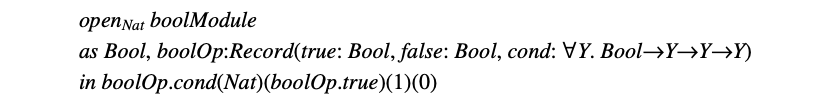

本文整理自 [Luca Cardelli, Type Systems](http://lucacardelli.name/papers/typesystems.pdf) 的第五章内容。欢迎 [star](https://github.com/wfnuser/plt) 和 [follow](https://github.com/wfnuser)。

# 二阶类型系统(Second-order Type Systems)

许多现代语言包含了类型参数(type parameters)、类型抽象(type abstraction)的特性。在一些语言的模块系统(module system)中可以找到类型参数的应用，例如一个通用模块、类或接口通过一个在之后提供的类型进行参数化。 Java 和 C# 计划中(编者：本文写作时间很早)的扩展在使用类和接口级别的类型参数。(C++ 的模板与类型参数类似，但实际上是宏展开的一种形式。) 如 ML 和 Haskell 这样的多态语言更普遍地在函数级别使用类型参数。类型抽象可以与模块结合在一起，在接口中以不透明类型的形式出现，如在 Modula-2 和 Modula-3 中。像 CLU 这样的语言在数据级别使用类型抽象，以获得抽象数据类型。这些高级特性可以通过所谓的二阶类型系统(second-order type systems)来建模。

二阶类型系统在一阶类型系统之上引入了**类型参数**(type parameters)的概念。 并引入了一套新的术语，写作 $λX.M$， 表示一段程序 $M$，它根据能代表任意类型的类型变量 $X$ 进行参数化。 例如，对于某个固定类型 $A$ 的恒等函数(identity function)，写作 $λx:A.x$ ， 可以通过对 $A$ 进行抽象并定义出参数化的恒等函数 $id := λX.λx:X.x$。 这样，通过类型实例化(type instantiation) $id \ A$， 我们可以轻而易举的产生指定类型 $A$ 的恒等函数，即 $λx:A.x$。

对应于新引入的术语 $λX.M$，我们也需要新的**普遍量化类型**(universally quantified types)。像 $λX.M$ 这样的项的类型可以表示成 $\forall X.A$，意味着对于任意类型 $X$，主体 $M$ 具有类型 $A$ (这里的 $M$ 和 $A$ 都可以包含 $X$ 的出现)。例如，参数化恒等函数的类型是 $id : \forall X.X→X$，因为对于所有的类型 $X$，类型实例化后的 $id \ X$ 都具有类型 $X→X$ 。

纯粹的二阶系统F2(见表23) 仅基于类型变量、函数类型和普遍量化类型(universally quantified type)。注意我们已经去掉了基本类型 $K$，因为现在我们可以使用类型变量表达基础类型。事实证明，几乎任何有用的基本类型都可以在 F2 中编码[4]。同样，积类型、和类型、存在类型和一些递归类型也都可以在 F2 中编码：多态性具有惊人的表达力。因此，从技术上来说，几乎不再需要单独处理这些类型构造。

### 表 23. F2 的语法

现代编程语言中的 F2 类型和项的自由变量可以用常规的的方式定义，$\forall X.A$ 在 $A$ 中绑定 $X$ 而 $\lambda X.M$ 在 $M$ 中绑定 $X$。 F2 最显著的特点是在类型实例化的类型规则 ($Val \ Appl2$) 中进行类型变量的替换。

### 表 24. F2 的断言

### 表 25. F2 的规则

F2 的断言(表24)和 F1 的断言相同，但环境更丰富。与 F1 相比，新规则(表25)新增了：($Env \ X$)，将类型变量添加到环境中；($Type \ Forall$)，从类型变量 $X$ 和可能出现 $X$ 的类型 $A$ 构造量化类型 $∀X.A$；($Val \ Fun2$)，构建一个多态抽象；以及($Val \ Appl2$)，实例化一个给定类型的多态抽象，其中 $[B/X]A$ 是用 $B$ 替换 $A$ 中所有自由出现的 $X$ 的子式。 例如，如果 $id$ 具有类型 $∀X.X→X$，并且 $A$ 是一种类型，那么通过($Val \ Appl2$)，我们有 $id \ A$ 具有类型 $[A/X](X \to X) \equiv A→A$。作为一个简单但有启发性的练习，读者可以试试构建 $id(∀X.X→X)(id)$ 的推导。

作为 F2 的扩展，我们可以采纳我们已经为 F1 讨论过的所有一阶构造。 而一个更有趣的扩展是考虑**存在量化类型**(existentially quantified types)，也称为**类型抽象**：

### 表 26. 存在类型(Existential types)

为了说明存在类型的用处，我们考虑一个布尔类型的抽象表示。如我们之前所说，布尔值可以表示为类型 $Unit+Unit$。我们现在可以展示如何对使用者隐藏布尔值的这种表示细节，因为使用者并不关心布尔值是如何实现的，仅仅希望使用 $true$ 、$false$ 和 $cond$ (条件)。我们首先为使用者定义一个接口，

该接口声明存在一个类型 $Bool$ (但没有透露任何实现细节)，且支持适当类型的操作 $true$、$false$和$cond$。条件通过其结果类型 $Y$ 进行参数化。

接下来，我们定义了这个接口的一个特定实现。一个将 $Bool$ 表示为 $Unit+Unit$ ，并通过 $case$ 语句实现 $cond$ 的实现。 布尔表示类型和相关布尔操作由 $pack$ 操作打包在一起。

最后，使用者可以通过打开这个模块来使用它，从而获得布尔类型的抽象名称 $Bool$，以及布尔操作记录的名称 $boolOp$。 这些名称在下面的示例中用于根据情况返回一个简单的自然数。(在 $in$ 之后的部分，本质上就是 $if \ boolOp.true \  then \ 1 \ else \ 0$。)

读者应该自己验证下这些示例中的类型检查是否满足先前给出的规则。需要注意的是，规则 ($Val \ Open$) 中隐含着一个重要的假设，即结果类型 $B$ 不能包含变量 $X$。 这个假设禁止了一些情况。 比如，在前一个示例中使用 $boolOp.true$ 作为 $open$ 的主体($in$ 之后的部分)是不可能的，因为这样结果类型将是变量 $Bool$。
由于这个假设，表示类型(representation type)的抽象名称 ($Bool$) 不能逃离 $open$ 的范围，因此拥有表示类型的值也不能逃离。这种限制是必要的，否则表示类型就可能会为使用者所知。

## 参考
[4] Böhm, C. and A. Berarducci, Automatic synthesis of typed λ-programs on term algebras.
Theoretical Computer Science 39, 135-154. 1985.

##
