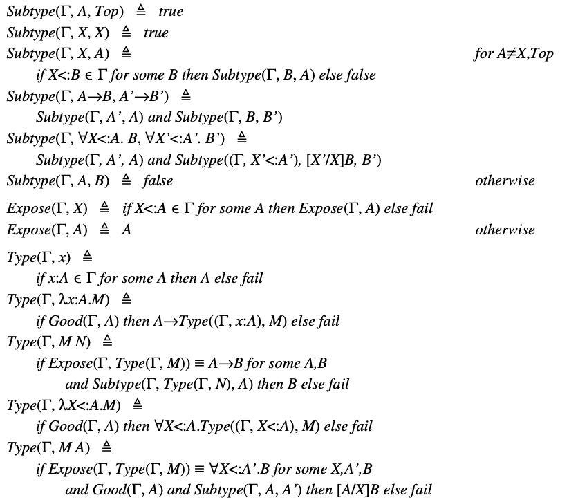

本文整理自 [Luca Cardelli, Type Systems](http://lucacardelli.name/papers/typesystems.pdf) 的第八章内容。欢迎 [star](https://github.com/wfnuser/plt) 和 [follow](https://github.com/wfnuser)。

# 类型推断

## 表35. $F_1$ 的类型推断

作为示例，让我们尝试在环境 $/phi, \ y:K→K$ 中对 $λz:K.y(z)$ 项进行类型推断。我们在这里提供了一个完整的 $F_1$ 推导。算法的步骤如下：

$F2 的类型推断算法（见表36）并不比 $F_1$ 的算法难，但它需要引入一个额外的子过程 $Good(\Gamma, A)$ 来验证源程序中遇到的类型是否合法。这个检查是必要的，因为在 $F_2$ 类型系统中存在未绑定的类型变量。此外，在类型实例化的情况下，还需要引入一个替换子过程，即 $M A$。

## 表36. $F_2$ 的类型推断算法

$F_{2<:}$ 的类型推断算法如表 37 所示，更为复杂。$Subtype(\Gamma, A, B)$ 试图判断在环境 $\Gamma$ 中， $A$ 是否是 $B$ 的子类型，乍看起来似乎很直接。然而，人们已经证明 $Subtype$ 只是一个半算法(semialgorithm)：它可能在某些不存在子类型关系的类型对 $A$、$B$ 上发散(diverge)。换句话说，对于类型不一致的程序，$F_{2<:}$ 的类型检查器可能会发散，尽管对于类型良好的程序仍会收敛并产生最小类型。更一般地说，$F_{2<:}$ 的类型系统是不可判定的[25]。已经过许多不同的工作试图将 $F_{2<:}$ 缩减为可判定的子集；目前最简单的解决方案是要求 $(Sub \ Forall<:)$ 中的量词界限相等(equal quantifiers bound)。无论如何，不一致的 $A$、$B$ 对在实践中出现概率很小。因此，这个算法在通常意义上仍然是安全的(sound)：只要它能找到一个类型，程序就不会出错。唯一令人担忧的情况只会出现在量词的子类型判定中，而将算法限制在 $F_{1<:}$ 中则是可判定的，并且可以得到正确的最小类型。

## 表37. $F_{2<:}$ 的类型推断算法

$F_{2<:}$ 就提供了一个有趣的例子，说明在类型推断中可能会有异常情况的(编者: 指的应该是会陷入无限循环的情况)。上面给出的类型推断算法在理论上是不可判定的(undecidable)，但在应用中却是可行的。它在几乎所有的程序上都是收敛且高效的；只有在一些类型病态(ill typed)的程序上才会发散，而这些程序本来就应该被拒绝。因此，根据引言中提出的标准，$F_{2<:>}$ 处于可接受和不可接受的类型系统的界限上。

##
